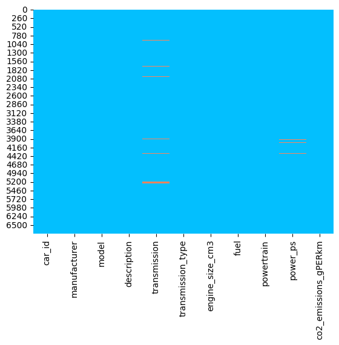

# <b>Machine Learning: An Investigation into Vehicle CO2 Emissions</b>

In this project, I investigate the recorded CO2 emissions (WLTP) of 6756 vehicles, and use supervised machine learning techniques to predict CO2 emissions from vehicle features, including the type of powertrain and size of the engine.

The data was obtained via the following UK government link:  
https://carfueldata.vehicle-certification-agency.gov.uk/downloads/default.aspx  
Note that the data at this link is subject to change. The raw data as I obtained it can be found in the data/raw directory [here](data/raw/Euro_6_latest.csv).

Below, I offer a report of the work performed in this project, describing the fundamental stages and key results.

<b>Report Version:</b> 31/03/2022

## License
[Apache 2.0 License](LICENSE)

## Table of Contents
1. [Introduction](#1-introduction)
2. [Getting Started](#2-getting-started)
3. [Data Sourcing and Initialisation](#3-data-sourcing-and-initialisation)  
    3.1 [Data Sources](#31-data-sources)  
    3.2 [Data Initialisation](#32-data-initialisation)  
4. [Exploratory Data Analysis](#4-exploratory-data-analysis)    
    4.1 [Initial Data Checks](#41-initial-data-checks)  
    4.2 [Data Cleansing](#42-data-cleansing)  
    4.3 [Outlier Analysis](#43-outlier-analysis)  
    4.4 [Data Preprocessing](#44-data-preprocessing)  
    4.5 [Correlation Analysis](#45-correlation-analysis)  
5. [Preliminary Modelling](#5-preliminary-modelling)  
    5.1 [Train/Test Split Analysis](#51-traintest-split-analysis)  
    5.2 [Feature Engineering](#52-feature-engineering)  
    5.3 [Preliminary Models](#53-preliminary-models)  
6. [Hyperparameter Tuning](#6-hyperparameter-tuning)  
    6.1 [Basic Tuning Techniques](#61-basic-tuning-techniques)  
    6.2 [Advanced Tuning Techniques](#62-advanced-tuning-techniques)  
    6.3 [XGB Ordinal Encoding](#63-xgb-ordinal-encoding)  
    6.4 [XGB One-Hot Encoding](#64-xgb-one-hot-encoding)  
    6.5 [XGB Ordinal Fewer Features](#65-xgb-ordinal-fewer-features)  
7. [Model Review](#7-model-review)  
    7.1 [Prediction Error Distribution](#71-prediction-error-distribution)  
    7.2 [Feature Importance](#72-feature-importance)  
8. [Closing Thoughts](#8-closing-thoughts)  
    8.1 [Possible Uses](#81-possible-uses)  
    8.2 [Possible Extensions](#82-possible-extensions)  

## 1. Introduction

In this project I set out to investigate how vehicle CO2 (tailpipe) emissions might be predicted as a function of properties of the vehicle using supervised machine learning techniques. Properties of the vehicle include the type of powertrain (e.g. Internal Combustion Engine (ICE), or Battery Electric Vehicle (BEV)) and the size of the engine.

I use Python and MySQL to perform cleansing, statistical analysis, and visualisation of UK government vehicle emissions data. I train XGBoost, Decision Tree, and Linear Regression models on the preprocessed data, and compare the performances of each model. I then produce several XGBoost models with hyperparameters tuned using Grid Search, Random Search, [Hyperopt](https://github.com/hyperopt/hyperopt), and [Trieste](trieste_citation.txt), and I compare the results and tuning speeds of each method. Finally, I review two of the models by investigating their accuracies, error distributions, feature importances, and their input requirements.

I primarily chose to undertake this project to develop my own skills in data sourcing, data cleansing, and a variety of supervised machine learning techniques.

One possible benefit from the results of this investigation may be evidence-driven insights into the key aspects of vehicle design that impact CO2 emissions.

A possible real-world application of the models produced could be data (entry) validation. This application would see the model acting as a passive error identifier, and may help to catch and prevent vitally incorrect data entering a database. I expand on this idea in Section 8.1.

## 2. Getting Started

It is not required to execute any of the code in this repository in order to obtain and review the results of this investigation. The stages and key results are described in this ProjectReport.md file, with some other secondary results being shown in the various "..._vis" folders of the project.

If you wish to follow along in a practical sense, for example by reproducing visualisations or training models, or if you wish to run any of the code for any other reason, then the Python dependencies are listed in the [requirements.txt](requirements.txt) file.

In addition to these libraries, you will also require an installation of MySQL. You might find the following tutorials helpful in getting set up:  
Windows: https://www.youtube.com/watch?v=2HQC94la6go&ab_channel=BlaineRobertson  
Mac: https://www.youtube.com/watch?v=5BQ5GvjiAR4&ab_channel=BlaineRobertson  
Linux: https://www.youtube.com/watch?v=0o0tSaVQfV4&ab_channel=webpwnized

As you install MySQL, make sure your username and password match those stored in [configprivate.py](src/data/dbLogin/configprivate.py). In the development of this project I used username = "root" and password = "password123".

If you wish to follow along, the Python scripts should be executed in the following order:
1. [dataInitialise.py](src/data/dataInitialise.py)
2. [dataInitialiseAnalyse.py](src/data/dataInitialiseAnalyse.py)
3. [dataClean.py](src/data/dataClean.py)
4. [dataCleanAnalyse.py](src/data/dataCleanAnalyse.py)
5. [dataPreprocess.py](src/data/dataPreprocess.py)
6. [dataPreprocessAnalyse.py](src/data/dataPreprocessAnalyse.py)
7. [trainTestAnalyse.py](src/models/trainTestAnalyse.py)
8. [train.py](src/models/train.py)  
9. [trainTunedOrdinal.py](src/models/trainTunedOrdinal.py)  
10. [trainTunedOnehot.py](src/models/trainTunedOnehot.py)  
11. [trainTunedOrdinalNoMan.py](src/models/trainTunedOrdinalNoMan.py)
12. [modelReview.py](src/models/modelReview.py)

Many of these files print text-based reports of their function and results, and tuning scripts take a while to run if fully executed, which is why I have not created a main script to run these files sequentially.

## 3. Data Sourcing and Initialisation

### 3.1 Data Sources

In searching for data sets to use for this project, I review various potential sources and considered their merits and limitations.

I first consider using the sample data sets available at [Teoalida](https://www.teoalida.com/cardatabase/the-biggest-car-database/). The sample sets contain a moderate number of examples (a few thousand), and provide a large number of fields (e.g. weight, dimensions, no. of doors, valves). However, the sample data contains a low variety of vehicles (only limited models of BMW, Ford, Toyota, Honda, VW), and obtaining a sufficient number of examples requires merging 3 separate data sets. There is also inconsistent naming of vehicles between each data set, so it's not clear whether vehicles are duplicated across each. Given the differences in fields between data sets, it would be hard to create unique keys to ensure vehicles aren't duplicated.

The [CMU StatLib library data](https://archive.ics.uci.edu/ml/datasets/auto+mpg) does not contain many examples (only 398), and only holds data for older vehicles (1970-1982), which is not representative of a real-world sample today.

The [Canadian government data](https://open.canada.ca/data/en/dataset/98f1a129-f628-4ce4-b24d-6f16bf24dd64?wbdisable=true) contains a better variety of vehicles, and a suitable number of records (~7000). However, there are not many fields describing the vehicles (just 5, and no e.g. weight or power).

The data from the [European Environment Agency](http://co2cars.apps.eea.europa.eu/) is promising. There are a good number of fields describing the vehicles (8: mass, wheel base...), a great variety of cars, and there are millions of records. However, there appear to be a large number of duplicate rows, and it is not immediately clear what the duplicate rows represent. I believe this data set has high potential for investigations of emissions, but lack of clarity around the duplicate rows reduced my confidence in the data, and I settled on a more suitable source, which I describe below.

The [UK government data](https://carfueldata.vehicle-certification-agency.gov.uk/downloads/download.aspx?rg=latest) (the version of the data I obtained is [here](data/Euro_6_latest.csv)) is clear, contains a good variety of cars (sports cars, sedans, SUVs etc...), and holds a suitable number of records (~7000). Unfortunately, weight of the vehicles is not recorded in this data, but otherwise there are suitable fields (6: fuel, powertrain...) which one would expect to be correlated with emissions. There are many rows which contain the same vehicle identifying values ("Manufacturer", "Model", and "Description"), while the other fields are frequently different, indicating these rows may be different versions of the same model. Of the sources reviewed, this source seems most suited for this project's purposes, and I proceed with this data.

### 3.2 Data Initialisation

In this stage, I use [dataInitialise.py](src/data/dataInitialise.py), which connects to the local MySQL server and creates a "vehicles" database. The script then creates the table "uk_gov_data" and populates it with the vehicles data in "Euro_6_latest.csv".

Key considerations in this stage include...  

* Selecting which fields from the raw data set to bring into MySQL. I bring in all fields describing the vehicles' characteristics, as these will eventually be used as features in models.
```python
govData = pd.read_csv('./data/raw/Euro_6_latest.csv', encoding="ISO-8859-1")
fields = ["Manufacturer", "Model", "Description", "Transmission", "Manual or Automatic", "Engine Capacity", "Fuel Type", "Powertrain", "Engine Power (PS)", "WLTP CO2", "WLTP CO2 Weighted"]
govData = govData[fields]
```

* Ensuring the correct CO2 emission values are selected. Plug-in Hybrid Electric Vehicles' (PHEVs') CO2 emissions are tested differently from other powertrain types under WLTP, so their scores come from the "WLTP CO2 Weighted" column.  
Further info...  
https://carfueldata.vehicle-certification-agency.gov.uk/search-by-low-emissions.aspx  
https://heycar.co.uk/guides/what-is-wltp  
https://carfueldata.vehicle-certification-agency.gov.uk/additional/2021/2021%20Booklet.pdf  
```python
for i in range(0, govData.shape[0]):
    if govData.iloc[i]["Powertrain"] == "Plug-in Hybrid Electric Vehicle (PHEV)":
        govData.loc[i,"WLTP CO2"] = govData.iloc[i]["WLTP CO2 Weighted"]
govData.drop(columns="WLTP CO2 Weighted", inplace=True)
```

## 4. Exploratory Data Analysis

### 4.1 Initial Data Checks

In this stage, I use [dataInitialiseAnalyse.py](src/data/dataInitialiseAnalyse.py), which checks for missing values and errors in the "uk_gov_data" table in the "vehicles" database.

The Points of Interest (POI) that arise and are resolved in this stage are:  

<b>POI 1</b>  
Nulls in "transmission". I identify that "transmission" nulls occur only if "fuel" = "Electricity". Therefore, a replacement "transmission" value should ideally already imply "fuel" = "Electricity". Reviewing unique values of "fuel" when "transmission" = "Auto" reveals that "transmission" = "Auto" only if "fuel" = "Electricity". Therefore, I will replace all "transmission" nulls with "Auto" in generating a dense data set in dataClean.py, resolving POI 1.

<b>POI 2</b>  
Nulls in "engine_size_cm3". I identify that "engine_size_cm3" nulls occur only if "fuel" = "Electricity". Reviewing unique values of "engine_size_cm3" when "fuel" = "Electricity" reveals that "fuel" = "Electricity" only if "engine_size_cm3" = "0.0". Therefore, I will replace the "engine_size_cm3" null with "0.0" in generating a dense data set in dataClean.py, resolving POI 2.

<b>POI 3</b>  
Nulls in "power_ps". I identify that "power_ps" nulls occur only if "fuel" contains "Electricity", and only if "co2_emissions_gPERkm" = "0.0". Reviewing unique values of "co2_emissions_gPERkm" when "power_ps" = "0.0" reveals that "power_ps" = "0.0" only if "co2_emissions_gPERkm" = "0.0". Since emissions are "0.0" for all the "power_ps" nulls, I will replace these nulls with "0.0" in generating a dense data set in dataClean.py, resolving POI 3.

<b>POI 4</b>  
"transmission_type" has "Electric - Not Applicable" values. Reviewing unique values of "fuel" when "transmission_type" = "Electric - Not Applicable" reveals "fuel" is either "Electricity" or "Petrol". The presence of petrol-fuelled cars where "transmission_type" = "Electric - Not Applicable" is unexpected. There are only 2, a Jeep and a Ferrari, so I manually validate these entries and learn that the actual transmission type for both is "Automatic":  
https://www.cars-data.com/en/jeep-renegade-1-3t-4wd-limited-specs/81427/tech  
https://www.cars-data.com/en/ferrari-f8-tributo-specs/104709/tech  
Therefore, I will replace the two instances of "Electric - Not Applicable" where "fuel" = "Petrol" in dataClean.py, resolving POI 4.

<b>POI 5</b>  
"engine_size_cm3" has "0.0" values. Reviewing unique values reveals that "engine_size_cm3" = "0.0" if only if "fuel" = "Electricity". This is to be expected as electric engines do not function with air displacement, resolving POI 5.

<b>POI 6</b>  
"power_ps" has "0.0" values. Reviewing unique values of "fuel" when "power_ps" = "0.0" reveals that "power_ps" = "0.0" only if "fuel" = "Electricity". This could be because (horse)power in BEVs is not directly comparable to power in other (combustion) vehicles, so has been left as "0.0":  
https://auto.howstuffworks.com/how-does-horsepower-figure-into-electric-cars.htm  
Furthermore, we see in (POI 7) that "fuel" = "Electricity" only if "co2_emissions_gPERkm" = "0.0". For unseen samples we would expect that if "power_ps" = "0.0", then the vehicle would be electric and hence emissions would be 0. Therefore, these values are consistent with what we expect to see in the data, resolving POI 6.

<b>POI 7</b>  
"co2_emissions_gPERkm" has "0.0" values. Reviewing unique values of "powertrain" when "co2_emissions_gPERkm" = 0.0 shows "powertrain" is either "(BEV)", "(HEV)", or "(PHEV)". The CO2 emissions for pure electric vehicles should be nil, so we would expect the "0.0" emissions when "powertrain" = "(BEV)".  
The other "co2_emissions_gPERkm" = "0.0" values are for hybrid electric vehicles and are not expected. The live database implies the HEV vehicles (both Land Rover Evoques) are actually PHEVs. The emission values on the live database imply the PHEV vehicle (Toyota RAV4) actually has emissions of 22g/km.  
Live database: https://carfueldata.vehicle-certification-agency.gov.uk/search-by-low-emissions.aspx  
Therefore, I will change the "powertrain" of the 2 HEV's to "(PHEV)" and their "co2_emissions_gPERkm" to "32" and "38", and I will change the "co2_emissions_gPERkm" of the PHEV to "22",  resolving POI 7.

Null values in the data set are visualised as a heatmap in Fig. 1 below.

<b>Fig. 1</b>  


### 4.2 Data Cleansing

In this stage, I use [dataClean.py](src/data/dataClean.py), which manipulates the "uk_gov_data" table to produce both [sparse](data/intermediate/uk_gov_data_sparse.csv) ("uk_gov_data_sparse") and [dense](data/intermediate/uk_gov_data_dense.csv) ("uk_gov_data_dense") tables, which address the points identified in the previous section (dataInitialiseAnalyse.py).

The sparse data set addresses points of interest other than POI 1, 2, and 3, i.e. it maintains the null values: 147 in "transmission", 1 in "engine_size_cm3", 44 in "power_ps". The dense data set is the same except that it addresses all POI's, so contains no null values.

### 4.3 Outlier Analysis

In this stage, I use [dataCleanAnalyse.py](src/data/dataCleanAnalyse.py), which creates visualisations from the "uk_gov_data_dense" table in the "vehicles" database. Visualisations are saved in data/intermediate_vis.

I investigate potential outliers and errors in the cleansed vehicle emissions data by inspecting the scatter plots, boxplots, and violin plots for each field. The outliers that I identify in this stage are:  

<b>Outlier 1</b>  
One ICE vehicle (purple) with approximately 80 emissions, 4000 engine size, and 580 power. The ICE outlier is a Mercedes G-Class MY 201.5. Reviewing online resources and comparing with another "G-Class MY 201.5" entry in the table suggests these emissions are too low for this vehicle, especially for an SUV:  
https://www.cars-data.com/en/mercedes-benz-g-63-amg-specs/82510/tech  
https://www.nextgreencar.com/view-car/67506/mercedes-benz-g-class-g-63-amg-4matic-auto-petrol-semi-automatic-7-speed/  
Therefore, I will assume there was an error in entering the data and I will replace these emissions with "377.0" in dataPreprocess.py, resolving Outlier 1.

<b>Outlier 2</b>  
Two PHEV vehicles (blue) with approximately 160 emissions, 4000 engine size, and 770 power. The PHEV outliers are Ferrari Stradale's. Reviewing online resources suggests the data for these vehicles are accurate (the Fiorano appears to be a high-performance version of the Stradale):  
https://www.cars-data.com/en/ferrari-sf90-stradale-specs/104720/tech  
https://www.roadandtrack.com/new-cars/future-cars/a27626676/ferrari-sf90-stradale-hybrid-hypercar-power-specs-photos/  
Therefore, I will leave these vehicles as are in the data as they are valid, resolving Outliers 2.

<b>Outlier 3</b>  
One HEV vehicle (red) with approximately 310 emissions, 2500 engine size, and 190 power. The HEV outlier is a Ford Galaxy. Reviewing online resources and comparing with another "Galaxy Model Year Post 2021, 2.5 Duratec (FHEV)" entry in the table suggests these emissions are too high for this vehicle:  
https://www.whatcar.com/ford/galaxy/mpv/25-fhev-190-titanium-5dr-cvt/96967  
https://www.motorparks.co.uk/technical-data/ford/galaxy/2.5-fhev-190-titanium-5dr-cvt  
Therefore, I will assume there was an error in entering the data and I will replace these emissions with "148.0" in dataPreprocess.py, resolving Outlier 3.

These outliers can be seen in Fig's 2, 3, and 4 below.

<b>Fig. 2</b>  


<b>Fig. 3</b>  


<b>Fig. 4</b>  


### 4.4 Data Preprocessing

In this stage, I use [dataPreprocess.py](src/data/dataPreprocess.py), which manipulates the "uk_gov_data_sparse" and "uk_gov_data_dense" table to produce "...preproc" tables, which address the outliers identified in dataCleanAnalyse.py.

### 4.5 Correlation Analysis

In this stage, I use [dataPreprocessAnalyse.py](src/data/dataPreprocessAnalyse.py) to recreate visualisations from the "uk_gov_data_dense_preproc" table in the "vehicles" database. Visualisations are saved in data/processed_vis.

I investigate the distributions and correlations in the preprocessed vehicle emissions data. The primary findings upon reviewing the preprocessed data are as follows:

<b>Median CO2 emissions by powertrain</b>  
The median CO2 emissions for ICEs, MHEVs, and HEVs are the highest, all between 151-164. Vehicles with these powertrains utilise the greatest proportion of emission-producing fuels in the data set, so it is not unexpected that their median emissions are highest.  

The median emissions for LPGs are slightly lower, at 137. Liquid petroleum gas produces less CO2 emissions than cars using petrol or diesel fuel, so this is not unexpected:  
https://www.drivelpg.co.uk/about-autogas/environmental-benefits/  

The median emissions for PHEVs are the lowest of vehicles which utilise some level of emission-producing fuels. Plug-in electric vehicles utilise less emission-producing fuel than all types of powertrain other than BEVs, since their batteries can be plugged in and charged without necessesity of combustion.  

The median emissions for BEVs is 0, since BEVs are fully electric-powered, producing no tailpipe emissions.

<b>Correlation between CO2 emissions and engine size</b>  
CO2 emissions and engine size are strongly positively correlated for ICEs and MHEVs, weakly positively correlated for PHEVs and HEVs, and there is no correlation for BEVs and LPGs.  

The correlations for ICEs and MHEVs are above 0.8, showing strong positive correlation. Vehicles with these powertrains utilise the greatest proportion of emission-producing fuels in the data set, so it is not unexpected that their engine sizes show the highest correlation with CO2 emissions.  

The correlation HEVs is below 0.4, showing weak positive correlation. The data only holds information for HEVs in a relatively small range of engine sizes (~1000-3400cm3, less than half the range for ICEs), and the variation of emissions at each engine size can be quite large, particularly around 2000cm3, so the observered correlation on this data is not strong. Furthermore, hybrid electric vehicles make use of regenerative breaking to charge their batteries, and also switch off their combustion engines while stopped, which might have more of an impact in reducing emissions the largr the engine size, potentially explaining why the HEV correlation is lower than its whole combustion and mild hybrid counterparts.  

The correlation for PHEVs is below 0.4, showing weak positive correlation. Plug-in electric vehicles utilise less emission-producing fuel than their hybrid counterparts, since their batteries can be plugged in and charged without necessesity of combustion. Therefore, the size of the combustion engine should have low relation to the emissions produced if the vehicle is using its plug-charged battery, so it is not unexpected that their engine sizes have reduced correlations with CO2 emissions.  

The correlations for BEVs and LPGs are not defined:  
BEVs are fully electric-powered, so produce no emissions, and their engines do not displace any air, so their engine sizes are 0. Therefore, all points lie at (0,0) and the correlation is undefined.  
LPGs in this data all have the same engine size of 999cm3 (and are all made by Dacia), so all points lie on the vertical line (999,y) and correlation is undefined.

<b>Correlation between CO2 emissions and power</b>  
CO2 emissions and power are strongly positively correlated for ICEs and MHEVs, positively correlated for HEVs, weakly positively correlated for PHEVs, and there is little/no correlation for BEVs and LPGs.

The correlations for ICEs and MHEVs are above 0.8, showing strong positive correlation. Vehicles with these powertrains utilise the greatest proportion of emission-producing fuels in the data set, so it is not unexpected that their powers show the highest correlation with CO2 emissions.

The correlation for HEVs is above 0.7, showing positive correlation. Hybrid electric vehicles are powered by batteries which are charged by a combustion engine and regenerative breaking. Therefore, emission-producing fuels are still the main source of energy for the vehicle, and this may explain why we see a similar (albeit weaker) correlation to ICEs and MHEVs.

The correlation for PHEVs is just above 0.4, showing weak positive correlation. Plug-in electric vehicles utilise less emission-producing fuel than their hybrid counterparts, since their batteries can be plugged in and charged without the use of combustion, so it is not unexpected that their powers have reduced correlations with CO2 emissions.

There is little/no correlation for LPGs. LPGs in this data (all made by Dacia) all have powers of either 91 and 100 and emissions between 120-150, i.e. they all perform very similarly.

The correlation for BEVs in not defined. BEVs are fully electric-powered, so produce no emissions; all points lie on the horizontal line (x,0) and the correlation is undefined.

<b>Other insights</b>  
Some other insights I spotted but won't investigate in detail are:  

* There is little difference in median emissions between vehicles using petrol and vehicles using diesel, regardless of whether the powertrain is ICE, MHEV, or PHEV.  

* The manufacturer with the greatest median emissions is Rolls Royce, at over 350 g/km.

## 5 Preliminary Modelling

### 5.1 Train/Test Split Analysis

In this stage, I use [trainTestAnalyse.py](src/models/trainTestAnalyse.py) to create visualisations of the train/test data sets generated from the "uk_gov_data_dense_preproc" table. Visualisations are saved in results/models/train_test_vis.

Before any models are trained on the data, I shuffle the preprocessed, dense, data set and  split it into a training set (80% of data) and a testing set (20% of data), using a fixed seed for reproducibility.

```python
testSize = 0.2
train, test = train_test_split(govData, test_size = testSize, random_state=1)
```

I then compare the distributions of the training and testing sets to assess how well they represent the whole data, by reviewing the scatter plots, box plots, histograms, and bar charts for each field. The aim of this stage is to ensure the training data contains a representative proportion of each kind of example, otherwise any trained models might develop a bias which might reduce accuracy. 

The primary findings upon reviewing the train/test data sets are:

<b>Emissions VS Categorical Features</b>  
The medians and distributions of the CO2 emissions for each option in "fuel", "powertrain", and "transmission_type" appear to be broadly similar across the board, indicating both data sets represent the overall data well. This can be seen in Fig's 5, 6, and 7 below.

<b>Fig. 5</b>  


<b>Fig. 6</b>  


<b>Fig. 7</b>  


<b>Emissions VS Continuous Features</b>  
Both training and testing data sets appear to have good representation of the overall data, with the testing set also picking up some of the extreme examples. This can be seen in Fig's 8 and 9 below.

<b>Fig. 8</b>  


<b>Fig. 9</b>  


<b>Histograms</b>  
The distributions of "co2_emissions_gPERkm", "engine_size_cm3", and "power_ps" appear to have similar shapes between the train and test sets, indicating good representation of the whole data. An example of this for CO2 emissions can be seen in Fig. 10 below.

<b>Fig. 10</b>  


<b>Barcharts</b>  
The frequencies of each option in each categorical feature are broadly as expected, at 80% for train, 20% for test, indicating good representation of the whole data. There is one main exception to this: 90% of the LPG vehicles have ended up in the training data, and 10% have ended up in the test data. This can be seen in Fig. 11 below.

<b>Fig. 11</b>  
  

Overall, the train and test data each appear to be representative of the whole data. There is a single exception of LPG vehicles, which are split 90%:10% in the train/test data. However, these vehicles are only a small portion of the whole data set and should not have a significant impact on model accuracy.

### 5.2 Feature Engineering

In the following stages, I will train a variety of XGB, Decision Tree, and Linear Regression models on the data. To ensure the models can be properly trained on the data, I now consider the manipulations and encodings that I will need to use on the training and testing data in order to produce arrays that supervised models can be trained and tested on.

<b>Continuous Feature Scaling</b>  
XGB and Decision Trees operate by learning optimal points in the features to create branches in their trees, without consideration of the distances/differences between values, so feature scaling is not needed for these models.

For linear regression models there can sometimes be a benefit to interpretability when feature scaling is used. If the features are scaled, then the Y-intercept parameter can be easily interpreted as the model prediction when each feature takes its mean value. However, feature scaling should not impact the accuracy of a linear regression model, and as interpretability of the linear regression model is not a priority for this project, I do not perform feature scaling for this model.

Therefore, I do not use any feature scaling in this project.

<b>Categorical Feature Encoding</b>  
All the models investigated in this project require numerical values as inputs, so I must find some suitable way of encoding the categorical feature values from characters to numbers, e.g. "fuel" = "Electrcitiy" to "fuel" = "1".

The two approaches I investigate in this project are Ordinal encoding and One-Hot encoding.
Ordinal encoding converts each categorical feature value into an integer sequentially.  
One-Hot encoding creates one dummy variable column for each categorical feature value, which holds either a 1 if the example has the corresponding feature value or a 0 if it does not. The leading dummy variable column is then dropped from the array (a leading 1 is implicility represented by the other columns being 0).

XGB models are constructed from an ensemble of decision trees, which determine optimal branch points based on the values of features without regard for the relative size of values (i.e., without regard for ordinality). Therefore, I train some XGB models using Ordinal encoding. The XGB documentation states there is not full support for categorical variables, just for partition or One-Hot encoded variables:  
https://xgboost.readthedocs.io/en/latest/tutorials/categorical.html  
Therefore, I also train some other XGB models using One-Hot encoding and compare these results with the Ordinal XGB models.

For the Scikit Decision Tree model I will use Ordinal encoding.

For the Linear Regression model, Ordinal encoding is not suitable as there is no meaning to the size of the values, e.g. "fuel" = "Electricity" = "1" is not less than "fuel" = "Diesel" = "2". Therefore, I will use One-Hot encoding for the Linear Regression model.

Categorical features are encoded as shown below.

```python
# Ordinal encoding of categorical features.
cateDict = {}
for category in cateFeatures:
    value = 0
    cateDict[category] = dict()
    for option in OrderedSet(X_ordinal[category]):
        cateDict[category][option] = value
        value += 1
    X_ordinal[category] = X_ordinal[category].map(cateDict[category])

# One-Hot encoding of categorical features.
cateOneHot = {}
for category in cateFeatures:
    X_onehot = pd.get_dummies(data=X_onehot, drop_first=True, columns = [category])
```

### 5.3 Preliminary Models

In this stage, I use [train.py](src/models/train.py) to train XGBoost, Scikit Decision Tree, and Scikit Linear Regression models on the "uk_gov_data_dense_preproc" data, and save the models in results/models/trained.

I train and compare the accuracies of the following 4 models, without tuning hyperparameters at this stage:  

1. XGB with Ordinal Encoding of categorical features  

2. XGB with One-Hot Encoding of categorical features  

3. Scikit Decision Tree - Ordinal  

4. Scikit Linear Regression - One-Hot  

Before model training, I shuffle the data and then split into training (80% of data) and testing (20% of data) sets, using a fixed seed for reproducibility. In training each model on the training set, I will provide the following hyperparameters as applicable...  

```python
objective = reg:squarederror,
learning_rate = 0.1,
max_depth = 10,
n_estimators = 50
```
The testing set acts as a hold-out to emulate real-world data, and is used as a final assessment for each model once trained.

The observed accuracies (R^2, Coefficient of Determination) of each model are shown in the table below.

| Model                                 | Train Accuracy | Test Accuracy |
| ------------------------------------- | --------------:| -------------:|
| 1. XGB - Ordinal                      | 0.962262       | 0.945486      |
| 2. XGB - One-Hot                      | 0.959849       | 0.950118      |
| 3. Scikit Decision Tree - Ordinal     | 0.937138       | 0.932501      |
| 4. Scikit Linear Regression - One-Hot | 0.886677       | 0.885848      |

The two XGB models seem to perform approximately equally, with One-Hot encoding providing a slight edge over Ordinal encoding in test accuracy. I will pursue tuning the hyperparameters for both types of XGB model in trainTunedOrdinal.py and trainTunedOnehot.py using Trieste's Bayesian Optimisation with a Gaussian Process (GPFlow).

The Decision Tree model is the next most accurate, achieving an accuracy slightly below that of the XGB model with Ordinal encoding.

The Linear Regression model is least accurate. We saw in the correlation analysis in Section 4.5 that some powertrain types have strong correlations between emission and engine size/power, so a reasonable accuracy here is not unexpected. However, from the scatter plots we can see that emissions, though clustered by powertrain type, are widely spread, so the other models achieving a better score is not unexpected either.

Also of note is that the test accuracies are very similar to the training accuracies (only slightly lower), indicating very little over-fitting.

## 6. Hyperparameter Tuning

When tuning a model, the objective is to maximise the model's expected accuracy on unseen data by choosing optimal hyperparameters. There are two components to doing this: minimising some measure of model error on the test data (the test data is held out during training and used to emulate real-world unseen data), and having some assurance that the test accuracy achieved is stable. By "stable", I mean that if we were to test the model on a different real-world data set, we can expect to achieve similar accuracy.

<b>Cross-Validation</b>  
To address stability, I utilise k-fold cross-validation while tuning the models. For given hyperparameter values, the training data is split into k equally-sized subsets. k number of models are trained on (k-1) training subsets while the last subset is held out as a validation set, so that each example in the training data is in a validation set for exactly one model. Each of the k models is evaluated by calculating its Root Mean Square Error on the left out validation set. Each set of hyperparameter values is evaluated by calculating the mean of the k model RMSE's, called the CVScore, as in the equation below,
```
CVScore = CVScore ( hyp_1, hyp_2, ..., hyp_n )
        = sum_(i=1,k) [ RMSE_validation_i( model_i(hyp_1, hyp_2, ..., hyp_n)) ] / k
```
where hyp_i is some hyperparameter of a model, RMSE_validation_i is a model's RMSE on the i'th validation set, and model_i is the model trained on data excluding the i'th training subset.

If we scored hyperparameter values purely by their accuracy on the testing set, good scores could be down to luck based on the incidental contents of that set. Evaluating hyperparameter values by their cross-validation score helps to ensure that our final chosen hyperparameter values do not lead to systematic over/under-fitting of models, increasing stability of model accuracy.

<b>Objective Function</b>  
For each type of model in the following stages (XGB Ordinal, XGB One-Hot etc...), I ultimately seek to find hyperparameter values which approximately minimise the CVScore. As the train and test sets are both representative of the whole data, this should also imply approximately minimising the testing accuracy.

In this sense, I consider the following objective function which needs to be minimised:  
```
CVScore = CVScore ( hyp_1, hyp_2, ..., hyp_n )
```

In the following subsection, I describe various the tuning techniques I review in this project.

### 6.1 Basic Tuning Techniques

<b>Grid Search</b>  
Grid Search takes as input a list of possible values for each hyperparameter we would like to tune in a model. Grid Search then calculates the k-fold CVScore for each possible combination of hyperparameters one by one, and returns the hyperparameters which gave the lowest CVScore.

<b>Random Search</b>  
Random Search also takes as input a list of possible values for each hyperparameter we would like to tune in a model. Random Search then calculcates the k-fold CVScore in a subset of the set of all combinations of the hyperparameters, again one at a time, and returns the hyperparameters which gave the lowest CVScore.

Random Search can frequently obtain better results than Grid Search, provided the list of possible hyperparameter values fed in are more refined (there are more combinations) than those fed into Grid Search. Otherwise, Random Search's search space would be a subset of the Grid Search search space and would return hyperparameters as good as or worse than Grid Search.

### 6.2 Advanced Tuning Techniques

Evaluating the CVScore for a given set of hyperparameters involves training k models and then comparing predictions on the k validation sets against the known values, which is computationally costly. Therefore, there is an incentive to make as few calls as possible to the true objective function while tuning.

One such method for this is using a probabilistic approximation of the objective function. The probabilistic model is constructed using points sampled from the true objective function, with each new sample point enhancing our approximation of the objective function. We can use the probabilistic model to make educated guesses about which hyperparameters are likely to lead to the lowest CVScore, thus approaching a minima faster and reducing the number of true objective function calls. 

<b>Trieste</b>  
We can use Trieste to execute this tuning technique. Trieste is a library which can be used for solving Bayesian optimization problems, and it is built on top of TensorFlow. First, I specify the hyperparameter search space (by providing an interval for each hyperparameter) over which to minimise the objective function. Then I initialise Trieste with a sample of points on the objective function, i.e. points in the hyperparameter space, each with a true CVScore value calculated by training and validating the model with the given hyperparameters.

Using these sample points, Trieste constructs its probabilistic approximation to the objective function using a Gaussian Process (via the GPFlow library). Then, to select the next best hyperparameter values at which to evaluate the true CVScore, I use Trieste's optimization procedure with the default acquisition rule of Efficient Global Optimization with Expected Improvement. Each new sample point enhances the probabilistic model, which is used to select the next hyperparameters. After a specified number of iterations, Trieste returns some hyperparameters, which ideally will yield a near-minimal CVScore.

<b>Hyperopt</b>  
Hyperopt is another library which can be used for solving Bayesian optimization problems. Finding optimal hyperparameters using Hyperopt follows a similar strategy as with Trieste. One difference between between Trieste and Hyperopt is that Hyperopt (currently) uses Tree Parzen Estimation to construct a probabilistic model, rather than a Gaussian Process as in Trieste.

### 6.3 XGB Ordinal Encoding

In this stage, I use [trainTunedOrdinal.py](src/models/trainTunedOrdinal.py) to train XGBoost models with hyperparameter tuning using Grid Search, Random Search, Hyperopt, and Trieste, and then save the models in results/models/tuned. The purpose of this stage is to compare the tuning speeds and resulting accuracies from the different tuning techniques. 

I train and compare 6 XGB models attained through the following tuning techniques:  

1. Grid Search - 8748 Iterations (Total Possible Combinations) - 3-Fold CV

2. Random Search - 8748 Iterations (More Refined Search Space) - 3-Fold CV

3. Hyperopt - 100 Iterations (Same Search Range as Random Search) - 10-Fold CV

4. Hyperopt - 300 Iterations (More Hyperparameters) - 10-Fold CV

5. Trieste - 100 Iterations (Same Search Range as Random Search) - 10-Fold CV

6. Trieste - 300 Iterations (More Hyperparameters) - 10-Fold CV

Before model training, I shuffle the data and then split into training (80% of data) and testing (20% of data) sets, using a fixed seed for reproducibility. Each method aims to minimise a k-fold cross-validation score on the training data in order to select optimal hyperparameters. The testing set will act as a hold-out to emulate real-world data, and will be used as a final assessment for each model once hyperparameters are found.

The observed accuracies (R^2, Coefficient of Determination) of each method are as follows:
| Method                           | Train Accuracy | Test Accuracy | Tuning Duration (s) |
| -------------------------------- | --------------:| -------------:| -------------------:|
| 1. Grid Search                   | 0.961497       | 0.953565      | 6223                |
| 2. Random Search                 | 0.963479       | 0.953614      | 5406                |
| 3. Hyperopt                      | 0.962829       | 0.954932      | 557                 |
| 4. Hyperopt more hyperparameters | 0.964786       | 0.956611      | 2283                |
| 5. Trieste                       | 0.964402       | 0.956253      | 786                 |
| 6. Trieste more hyperparameters  | 0.963918       | 0.956700      | 3120                |

All the models perform very similarly. The test accuracies are very similar to the training accuracies (only slightly lower), indicating very little over-fitting. The greatest test accuracy is 95.67%, using hyperparameters found with Trieste. The lowest test accuracy is 95.36%, obtained using Grid Search.

It is also worth reviewing the tuning durations. In this setup, Grid Search takes the longest to run. Random Search provides a small speed improvement along with a tiny accuracy increase. Both Hyperopt and Trieste offer substantial speed increases as well as improvements to the model accuracies. It is worth noting that with appropriate parallelization and use of better hardware (in particular GPUs), different results might have been discovered.

Further analysis of the results could involve comparing the values of the hyperparameters found in each method and considering where the minima of the true objective function may lie, but this is outside the scope of this project.

I review the model fitted using Trieste with more hyperparameters (method 6) further in Section 7.

### 6.4 XGB One-Hot Encoding

In this stage, I use [trainTunedOnehot.py](src/models/trainTunedOnehot.py) to train an XGB model with One-Hot encoding and hyperparameter tuning using Trieste, and save the model in results/models/tuned. The purpose of this stage is to compare the accuracy of this XGB model with the accuracy of model 5 in the previous subsection, which uses Ordinal encoding.

The procurement of train/test data and the use of cross-validation is the same as in the previous subsection, with 10-fold CV used for both models. I use Trieste to tune the model, allowing 100 evaluations, and I use the same hyperparameter Search Space as method 5. The only difference in setup is the encoding, for fair comparison.

The observed accuracies (R^2, Coefficient of Determination) of the method here and of method 5 in the previous subsection are:
| Method                | Train Accuracy | Test Accuracy | Tuning Duration (s) |
| --------------------- | --------------:| -------------:| -------------------:|
| Trieste - One-Hot     | 0.963519       | 0.955957      | 1812                |
| (5) Trieste - Ordinal | 0.964402       | 0.956253      | 786                 |

The models perform approximately equally, with Ordinal encoding (95.35%) having a marginally higher accuracy than One-Hot encoding (95.60%) in this case.

Considering XGB documentation states there is not full support for categorical variables, just for partition or One-Hot encoded variables, this result might be unexpected:  
https://xgboost.readthedocs.io/en/latest/tutorials/categorical.html  
However, the cardinality of the categorical variables is not that high (greatest number of options is 42 for "transmission"), so perhaps XGB was still able to sufficiently split the encoded categories to identify patterns, possibly explaining why the Ordinal model still performs well.

Also worth noting is that tuning hyperparameters took much longer for the One-Hot model than for the Ordinal model, at 1812s vs 485s. This is likely due to the One-Hot training data becoming a much larger, sparse data set once encoded, and as a result model evaluations (obtaining cross-validation scores) take much longer. As the two models otherwise perform approximately equally, the speed of the Ordinal model tuning indicates Ordinal encoding might be superior in this context.

### 6.5 XGB Ordinal Fewer Features

In this stage, I use [trainTunedOrdinalNoMan.py](src/models/trainTunedOrdinalNoMan.py) to train an XGB model with hyperparameter tuning using Trieste, excluding the feature "manufacturer", and save the model in results/models/tuned. The purpose of this stage is to compare the accuracy of this XGB model with the accuracy of model 6 in the previous subsection, which includes "manufacturer" as a feature.

The procurement of train/test data and the use of cross-validation is the same as in the previous subsection, with 10-fold CV used for both models. I use Trieste to tune the model, allowing 300 evaluations, and I use the same expanded hyperparameter Search Space as method 6. The only difference in setup is the exclusion of "manufacturer" in this model, for fair comparison.

The observed accuracies (R^2, Coefficient of Determination) of the model here and of model 6 in Section 6.3 are:
| Method                        | Train Accuracy | Test Accuracy | Tuning Duration (s) |
| ----------------------------- | --------------:| -------------:| -------------------:|
| Trieste - No Manufacturer     | 0.961333       | 0.954035      | 3222                |
| (6) Trieste - w/ Manufacturer | 0.963918       | 0.956700      | 3120                |

The models perform approximately equally. The model utilising "manufacturer" has a slightly higher accuracy (95.67%) than the model ("NoMan" model) excluding this feature (95.40%).

Therefore, the exclusion of "manufacturer" as a feature in this context has little impact on model accuracy, and it would be valid to consider using the NoMan model over the model with the greater number of features, as the NoMan model has the benefit of requiring less data per example.

The speed of tuning the hyperparameters is approximately equivalent between the two models (3222s vs 3120s), which is not too unexpected.

I review the NoMan model further in Section 7.

## 7. Model Review

In this stage, I use [modelReview.py](src/models/modelReview.py) to compare the XGB Ordinal encoding (Trieste-tuned) model and equivalent NoMan model (excludes "manufacturer" from features), and save visualisations in results/models/tuned_vis.

I have created several models predicting CO2 emissions of vehicles using a variety of methods and tuning techniques, and I will now review the two models which appear to be the best candidates: the two XGB models with Ordinal encoding and with hyperparameters tuned using Trieste (300 evaludations).

* One model utilises the features "manufacturer", "transmission", "transmission_type", "engine_size_cm3", "fuel", "powertrain", and "power_ps" (the "Full" model).

* The other utilises the same features except excludes "manufacturer" (the "NoMan" model).

The observed accuracies (R^2, Coefficient of Determination) of these models are:
| Model       | Train Accuracy | Test Accuracy | Test RMSE | Tuning Duration (s) |
| ----------- | --------------:| -------------:| ---------:| -------------------:|
| Full model  | 0.963918       | 0.956700      | 11.567392 | 3120                |
| NoMan model | 0.961333       | 0.954035      | 11.918023 | 3222                |

As discussed in Section 6.5, the models perform approximately equally. As the NoMan model requires less data per example (no information about the manufactuer is required) than the Full model, one may consider using the NoMan model over the Full model to obtain similar performance.

### 7.1 Prediction Error Distribution

The Prediction Error Distribution graphs visualise the errors of the models across each percentile of the train and test data sets. The distributions can be seen in Fig's 12 and 13 below.

<b>Fig. 12</b>  
  

<b>Fig. 13</b>  
  

The graphs shows that a small proportion (~20%) of the train/test sets have prediction errors larger than the test RMSEs (11.6 g/km for Full, 11.9 g/km for NoMan). The graphs also shows that the prediction error grows rapidly at the higher percentiles of the data sets, due to significant prediction errors on a small proportion of the data.

The vehicles in the test set with the 10 largest errors as predicted by the Full model are:
```
car_id    manufacturer                                model  ...  powertrain  power_ps  emissions  prediction      error
  1333            FORD  Tourneo Custom Model Year Post 2021  ...       (ICE)       105      153.0  240.061478  87.061478
  1345            FORD  Tourneo Custom Model Year Post 2021  ...      (MHEV)       130      145.0  218.706024  73.706024
  1348            FORD  Tourneo Custom Model Year Post 2021  ...      (MHEV)       185      265.0  200.960464  64.039536
  4225   MERCEDES-BENZ                     G-Class MY 201.5  ...       (ICE)       585      377.0  313.194244  63.805756
  3964   MERCEDES-BENZ         GLE Estate Model Year 2021.5  ...       (ICE)       245      218.0  164.095993  53.904007
  2653      LAND ROVER                          Velar, 20MY  ...       (ICE)       300      215.0  263.069885  48.069885
  4274   MERCEDES-BENZ              GLC SUV Model Year 2022  ...       (ICE)       510      300.0  253.034454  46.965546
  3508   MERCEDES-BENZ                GLC Model Year 2020.5  ...       (ICE)       510      298.0  253.034454  44.965546
  4308   MERCEDES-BENZ                                  GLS  ...       (ICE)       330      251.0  206.231155  44.768845
  1136            FORD        Focus Model Year Post 2021.75  ...       (ICE)       150      124.0  165.160431  41.160431
```

Validating the data for these examples by searching online indicates there may be some leftover errors in the data:
* From the documentation, it is not clear that the emissions values for the Ford Tourneo vehicles are correct; they should possibly all be around 200 g/km, closer to the model prediction:  
https://www.ford.co.uk/content/dam/guxeu/uk/documents/feature-pdfs/FT-New_Tourneo_Custom.pdf
* The Mercedes GLE Estate vehicle emissions should possibly be lower, between 172-192 g/km, closer to the model prediction:  
https://www.mercedes-benz.com/en/vehicles/wltp/wltp-fuel-consumption-and-emission-values/

The other vehicles in the list appear to be outliers or exceptions to the trends the model has identified. Less accurate predictions for vehicles that don't fit the general distribution are not unexpected.

### 7.2 Feature Importance

The Feature Importance charts visualise the value of each feature to each model, in terms of the improvements in accuracy attained to the branches it is on. The charts can be seen in Fig's 14 and 15 below. 

<b>Fig. 14</b>  
 

<b>Fig. 15</b>  
 

<b>Fuel and Powertrain</b>  
Both charts show that "fuel" and "powertrain" are valuable features. This is not unexpected given the clustering seen in the "VS engine_size_cm3" and "VS power_ps" graphs, and the distinct distributions seen in the "VS fuel" and "VS powertrain" graphs.

It appears the importances of "fuel" and "powertrain" may be inversely related to each other. This may be because they contain similar information, e.g. "fuel" = "electricity" if and only if "powertrain" = "...(BEV)", so where a model relies heavily on one of these features, it may not need to use the other.

<b>Transmission Type</b>  
The NoMan model values "transmission_type" very highly. While different transmission types do have distinct distributions ("VS transmission_type" graphs), I may have initially expected the models to gain more from "powertrain" like in the Full model, as this contains similar information but at a more granular level. However, the NoMan model may be extracting relevant trends out of "transmission_type" and "fuel", as indicated by the high value of "fuel", and "powertrain" may no longer be so useful.

<b>Engine Size</b>  
"engine_size_cm3" has moderate value to each model, as does "power_ps" in the Full model. This is not unexpected considering the correlations investigated in Section 4.5.

<b>Manufacturer</b>  
The Full model identifies "manufacturer" as being of low importance, providing further evidence that we can expect the NoMan model to still perform well even though it does not use "manufacturer".

## 8. Closing Thoughts

### 8.1 Possible Uses

A possible real-world application of the models produced could be data (entry) validation. Once a model has been trained on data in a data set, both existing data and future insertions could be checked against the model's prediction: i.e. a flag could be raised if, for a given record, the recorded emissions are beyond some tolerance of the model's predicted emissions based on the other field values. The database manager could then manually validate the inserted example for errors, such as typos or inaccurate data, and either amend the data or confirm its validity.

This application would see the model acting as a passive error identifier, and may help to catch and prevent vitally incorrect data entering a database. For example, in this government vehicles data set, these models combined with automated validation might raise flags for the examples above. As it appears that some of
these examples may have inaccurate data, this may help in spotting and correcting the errors.

One possible benefit from the results of this investigation may be evidence-driven insights into the key aspects of vehicle design that impact CO2 emissions. For example, from the "VS powertrain" graphs as shown in Sections 4.3 and 5.1, it can be seen that although Mild Hybrid Electric Vehicles and Hybrid Electric Vehicles utilise some electricity, there is no impact on the median emissions for these vehicle types. This is in contrast to Plug-in Hybrid Electric Vehicles, which have much lower median emissions.

### 8.2 Possible Extensions

Next steps or improvements upon this work may include:

* Further development of models which require even fewer features than the NoMan model. The feature importance charts indicate that there may be some interchangeability between the importance of various features, such as "powertrain", "fuel", and "transmission_type". Therefore, investigating the data with a Factor Analysis or Multiple Correspondence Analysis (MCA) may reveal hidden stuctures in the data and help reduce dimensionality. A model might then be built requiring fewer features.

* Further cleansing and validating of the data prior to training the model may produce models with higher accuracy. Now that models have been produced, it may be possible to identify and correct remaining errors in the data following a process similar to that described above. A new model could then be trained, possibly attaining greater accuracy.